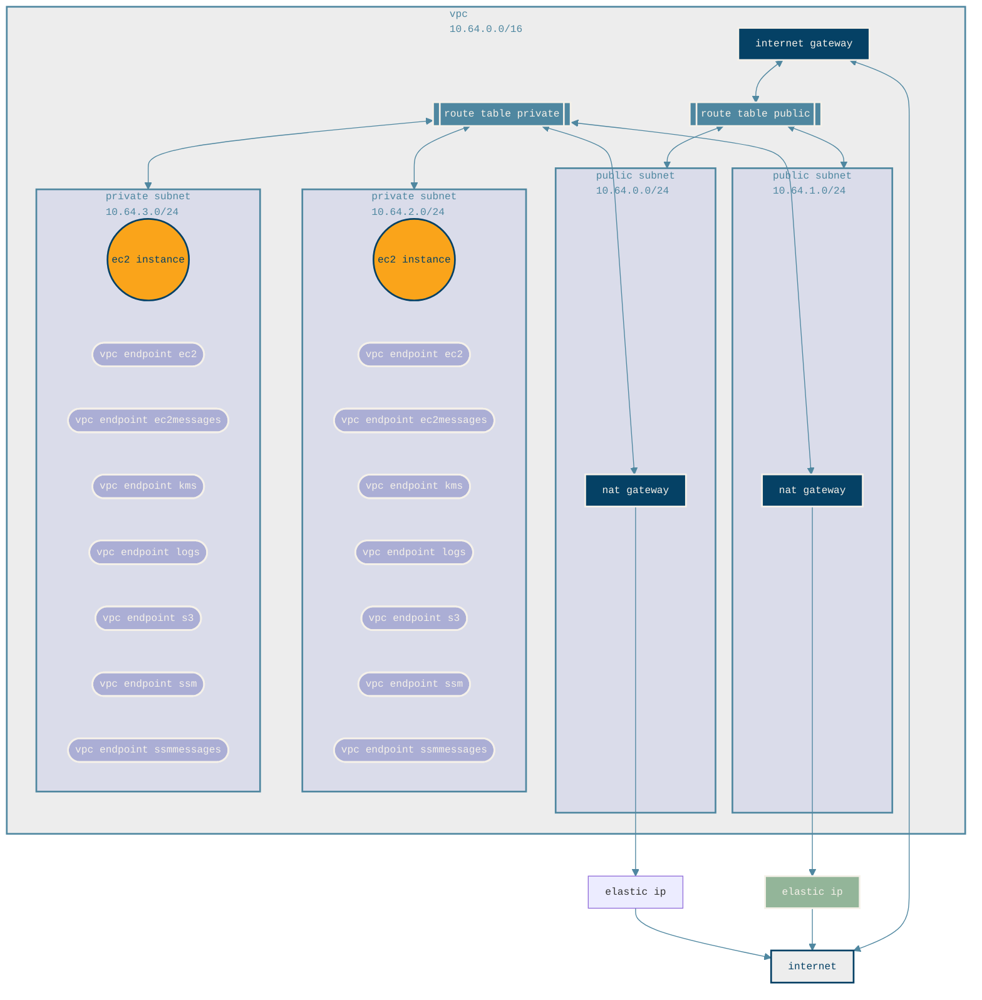

# ec2-lab

Terraform configuration to provision a simple lab environment in AWS consisting of VPC with public and private subnets and an EC2 instance on Amazon Linux 2023 that applies an Ansible playbook on the first boot.

## Overview



This repository contains the following Terraform configurations.

### vpc

Terraform configuration to create VPC containing Internet Gateway, NAT Gateways, public and private subnets, route tables, and VPC endpoints required for AWS Systems Manager.

This Terraform configuration creates the following resources:

| Name | Resource Type | Description |
| ---- | ------------- | ----------- |
| `lab-${aws-region}-vpc` | VPC | VPC with 10.64.0.0/16 CIDR |
| `lab-${aws-region}-subnet-public-0` | Subnet | Public subnet in availability zone A with 10.64.0.0/24 CIDR |
| `lab-${aws-region}-subnet-public-1` | Subnet | Public subnet in availability zone B with 10.64.1.0/24 CIDR |
| `lab-${aws-region}-subnet-private-0` | Subnet | Private subnet in availability zone A with 10.64.2.0/24 CIDR |
| `lab-${aws-region}-subnet-private-1` | Subnet | Private subnet in availability zone B with 10.64.3.0/24 CIDR |
| `lab-${aws-region}-igw` | Internet Gateway | Internet Gateway for public subnets |
| `lab-${aws-region}-eip-ngw` | Elastic IP | Elastic IP for NAT Gateway |
| `lab-${aws-region}-ngw` | NAT Gateway | NAT Gateway for private subnets |
| `lab-${aws-region}-rtb-private` | Route table | Route table for private subnets with route for NAT Gateway |
| `lab-${aws-region}-rtb-public` | Route table | Route table for public subnets with route for Internet Gateway |
| `lab-${aws-region}-sg-vpce` | Security Group | Security group for VPC endpoints |
| None | Route table association | Route table association for `lab-${aws-region}-rtb-private` to private subnets |
| None | Route table association | Route table association for `lab-${aws-region}-rtb-public` to public subnets |
| None | VPC endpoint | Interface VPC endpoint for `com.amazonaws.${aws-region}.ec2` service name |
| None | VPC endpoint | Interface VPC endpoint for `com.amazonaws.${aws-region}.ec2messages` service name |
| None | VPC endpoint | Interface VPC endpoint for `com.amazonaws.${aws-region}.kms` service name |
| None | VPC endpoint | Gateway VPC endpoint for `com.amazonaws.${aws-region}.s3` service name |
| None | VPC endpoint | Interface VPC endpoint for `com.amazonaws.${aws-region}.ssm` service name |
| None | VPC endpoint | Interface VPC endpoint for `com.amazonaws.${aws-region}.ssmmessages` service name |

### ec2

Terraform configuration to create S3 bucket, IAM role for EC2 instance, EC2 security group, EC2 key pair, and EC2 instance:

+ The contents of the `ec2\files\s3` directory are uploaded to the S3 bucket
+ The IAM role for the EC2 instance contains the required permissions for the EC2 instance to be managed by AWS Systems Manager and get objects from the S3 bucket
+ The EC2 security group is configured to allow SSH access from the public IP address of the internet connection the Terraform configuration was applied from
+ The EC2 key pair is generated when applying the Terraform configuration and output to `ec2/keypair.pem`
+ The EC2 instance runs Amazon Linux 2023 and is configured with the user data script in `ec2/files/userdata.sh`
  + The user data script:
    + Installs Python 3, `boto3`, Ansible, the `amazon.aws` Ansible collection, and the `community.general` Ansible collection
    + Downloads all files from the S3 bucket to `/opt/ansible/`
    + Applies the Ansible playbook `main.yml` from `/opt/ansible/`

This Terraform configuration creates the following resources:

| Name | Resource Type | Description |
| ---- | ------------- | ----------- |
| `lab-${aws-account-id}-${aws-region}` | S3 bucket | S3 bucket for EC2 instance files |
| `lab-ec2` | IAM role | IAM role with EC2 instance profile for EC2 instance |
| `lab-ec2` | IAM policy | IAM policy allowing access to get objects from S3 bucket |
| None | IAM policy attachment | `lab-ec2` IAM policy attachment to `lab-ec2` IAM role |
| None | IAM policy attachment | `AmazonSSMManagedEC2InstanceDefaultPolicy` IAM policy attachment to `lab-ec2` IAM role |
| None | TLS private key | EC2 key key private key |
| `lab-${aws-region}-key-pair` | EC2 keypair | EC2 key pair for EC2 instance. Private key output to `keypair.pem` |
| `lab-${aws-region}-sg-ec2` | Security group | Security group for EC2 instance |
| `lab-${random-name}` | EC2 instance | EC2 instance |

To connect to the EC2 instance after provisioning:

+ If the EC2 instance was provisioned in a public subnet:
  + Retrieve the public IP address of the EC2 instance from the AWS console
  + SSH into the EC2 instance using the EC2 keypair

    ```bash
    ssh ec2-user@${public-ip} -i keypair.pem
    ```

+ If the EC2 instance was provisioned in a private subnet:
  + Use AWS Systems Manager Session Manager

After connecting to the EC2 instance, you can review the logs of the Ansible playbook in the file at `/var/log/cloud-init-output.log`

## Usage

### Ansible playbook

The Ansible playbook that is executed on the EC2 instance is located at `ec2/files/s3/main.yml`. All files in the `ec2/files/s3/` directory are synced to the EC2 instance upon its first boot. Customize the Ansible playbook as needed prior to applying the `ec2` Terraform configuration.

### Provisioning

> [!WARNING]
> The Terraform configurations must be applied in the order specified by this section.

To provision the resources:

1. Set AWS credential environment variables
  
    ```bash
    export AWS_ACCESS_KEY_ID=""
    export AWS_SECRET_ACCESS_KEY=""
    ```

1. Apply `vpc` Terraform configuration

    ```bash
    cd vpc
    terraform init
    terraform apply
    ```

1. Apply `ec2` Terraform configuration
  
    ```bash
    cd ec2
    terraform init
    terraform apply
    ```

### Deprovisioning

To delete the provisioned resources, the Terraform configurations are destroyed in reverse order:

1. Destroy the `ec2` Terraform configuration
  
    ```bash
    cd ec2
    terraform destroy
    ```

1. Destroy the `vpc` Terraform configuration
  
    ```bash
    cd vpc
    terraform destroy
    ```

## Documentation

[AWS provider | Terraform Registry](https://registry.terraform.io/providers/hashicorp/aws/latest/docs)
